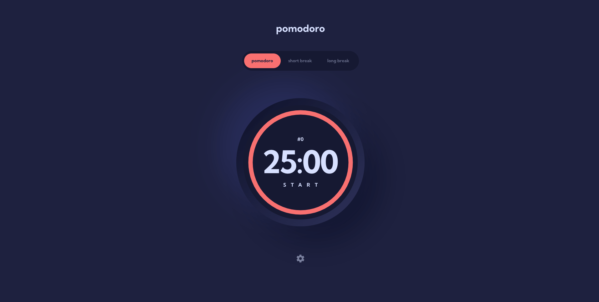
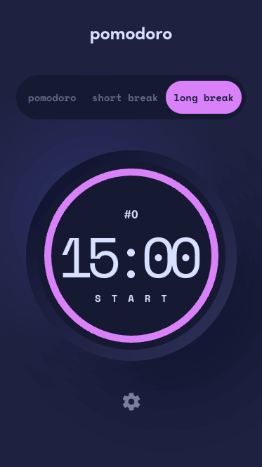

# Frontend Mentor - Pomodoro app solution

This is a solution to the [Pomodoro app challenge on Frontend Mentor](https://www.frontendmentor.io/challenges/pomodoro-app-KBFnycJ6G). Frontend Mentor challenges help you improve your coding skills by building realistic projects.

## Table of contents

- [Overview](#overview)
  - [The challenge](#the-challenge)
  - [Screenshot](#screenshot)
  - [Links](#links)
- [My process](#my-process)
  - [Built with](#built-with)
  - [What I learned](#what-i-learned)
  - [Continued development](#continued-development)
  - [Useful resources](#useful-resources)
- [Author](#author)
- [Acknowledgments](#acknowledgments)

## Overview

### The challenge

Users should be able to:

- Set a pomodoro timer and short & long break timers
- Customize how long each timer runs for
- See a circular progress bar that updates every minute and represents how far through their timer they are
- Customize the appearance of the app with the ability to set preferences for colors and fonts

### Screenshot





### Links

- Solution URL: [Pomodoro-app github repo](https://github.com/Furxx2000/Pomodoro-app)
- Live Site URL: [Pomodoro app](https://furxx2000.github.io/Pomodoro-app/)

### Built with

- Semantic HTML5 markup
- Flexbox
- CSS Grid
- Mobile-first workflow
- [React](https://reactjs.org/) - JS library
- [Vite](https://vitejs.dev/) - Build tool
- [TypeScript](https://www.typescriptlang.org/) - Strongly typed javaScript
- [Tailwind CSS](https://tailwindcss.com/) - For styles

### What I learned

1. Circular progress bar:
   It's the first time to create a circular progress bar, we need a svg element within two circle element for that.
   And set some css especially for circle like stroke-dashoffset, stroke-dasharray, cs, cy, r...
   ```html
    <svg className='absolute w-[258px] h-[258px] place-self-center md:w-[353px] md:h-[353px]'>
      <circle
        cx='50%'
        cy='50%'
        r={circleValue}
        className='timer-progress-bar transition ease-in'
      ></circle>
      <circle
        cx='50%'
        cy='50%'
        r={circleValue}
        style={{
          strokeDasharray: `${strokeValue}`,
          strokeDashoffset: `calc(${strokeValue} - (${strokeValue} * ${
            +curValue.toFixed(3) * 100
          } / 100)`,
        }}
        className={`timer-progress-bar transition ease-in ${curTheme.color}`}
      ></circle>
    </svg>
   ```
2. Dynamically change css with tailwind:
   Last time I use styled-component on project and it's really good for dynamically changing css.
   But the same trick in tailwind is not working, if tailwind className has been modified, it's just normal string won't work anymore.
   We always return full string instead of insert variable in it.
   Good

   ```js
   return 'hover:text-theme-1';
   ```

   Bad

   ```js
   return `hover:text-theme-${number}`;
   ```

   We can also create an object for classes:

   ```js
   const classes = {
     selector:
       'rounded-full hover:ring-2 ring-light-gray ring-offset-4 w-10 h-10 transition ease-in',
     active: (isSelected: boolean) =>
       isSelected
         ? 'bg-dark-blue-2 text-white'
         : 'bg-light-gray text-dark-blue-1',
   };

   <button
     className={`${classes.selector} ${classes.active(font.isSelected)} ${
       font.fontType === 'font-serif'
         ? font.fontType
         : `${font.fontType} font-bold`
     }`}
     onClick={() => handleSetFont(font.fontType)}
   >
     Aa
   </button>;
   ```

### Continued development

The useThemeState custom hook has too many different kinds of state, will separate it into small group.

### Useful resources

- [Pomofocus](https://pomofocus.io/) - The pomofocus is a really nice pomodoro app, which helped me to understand the actual behavior of pomodoro timer.
- [Circular progress bar](https://www.youtube.com/watch?v=V_G1WzPjb4o) - This is an amazing clip which helped me finally understand how to create a circular progress bar. I'd recommend it to anyone still learning this concept.

## Author

- Frontend Mentor - [@Furxx2000](https://www.frontendmentor.io/profile/Furxx2000)
- Twitter - [@Furxx2000](https://www.twitter.com/furxx2000)

## Acknowledgments
